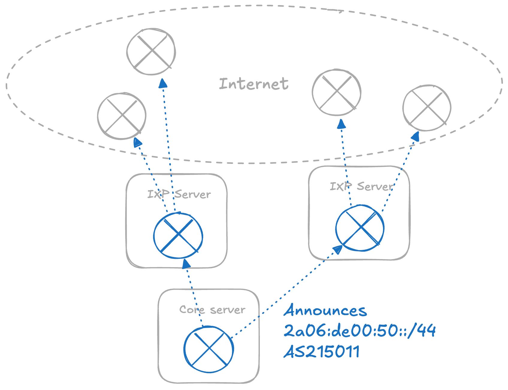
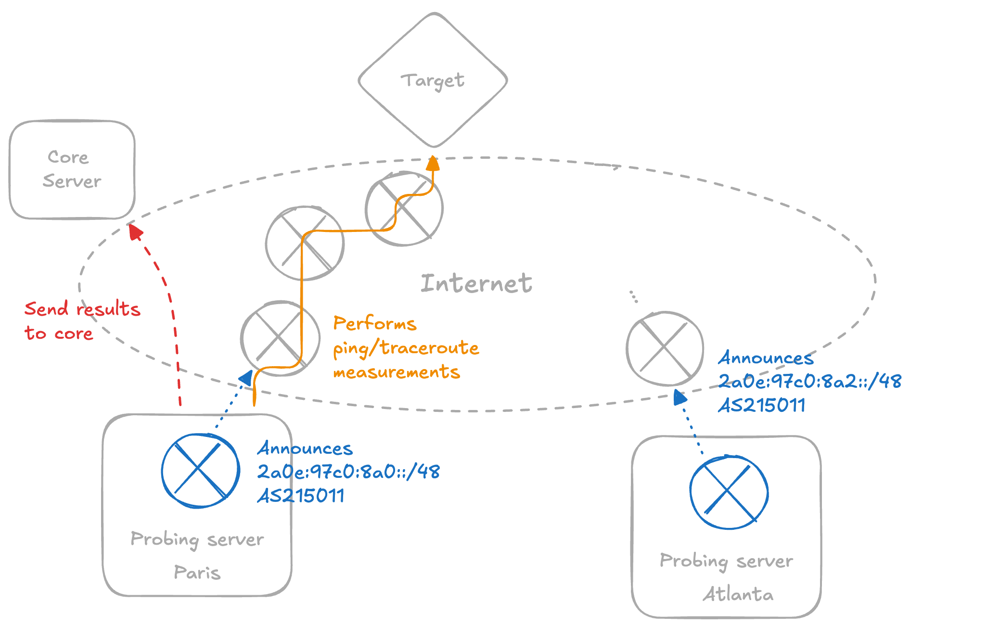
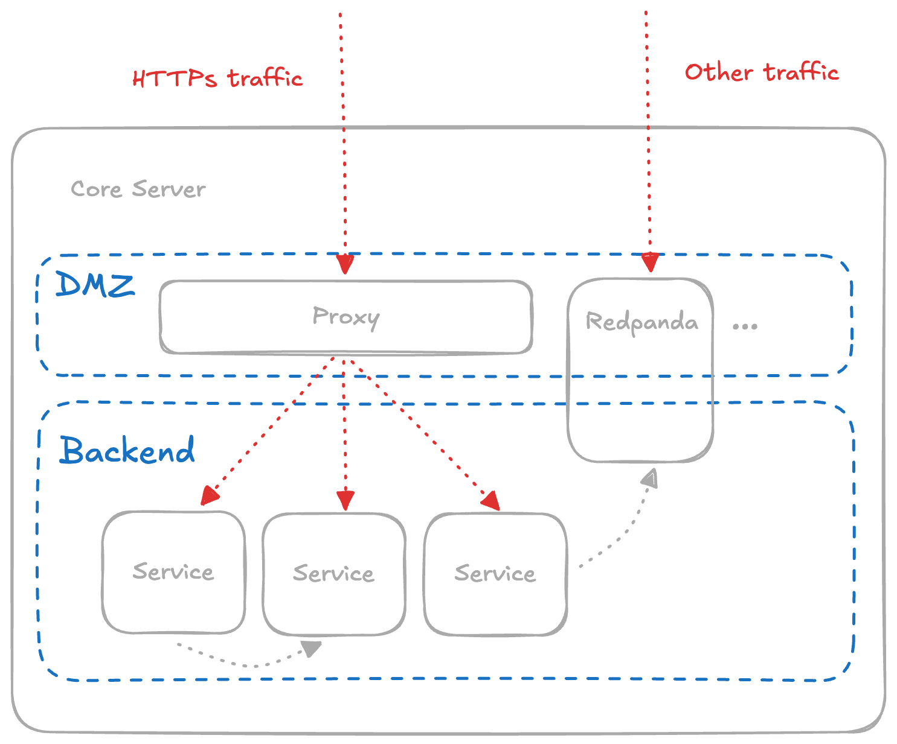

This page offers an overview of the **nxthdr** platform's infrastructure, outlining its key components and progressively building a complete picture of the system. The infrastructure is managed as code and is open-source, accessible in the [infrastructure](https://github.com/nxthdr/infrastructure) repository.

## as215011 Network

We operate the **as215011** Asynchronous System (AS) network to enable Internet-scale peering and routing experiments.

Currently, as215011 consists of servers running [BIRD](https://bird.network.cz/) routing daemon located in Frankfurt and Amsterdam. Those servers are uniquely connected to Internet Exchange Point (IXP) LANs, allowing us to peer with multiple ASes and exchange routing information.

In addition, we use as215011 to reach nxthdr services, allowing us to dogfood our own network. Each of those IXP servers is connected to a core server via a WireGuard tunnel. The core server announces the prefix `2a06:de00:50::/44` to the IXP servers, which then propagate it to the Internet. As a result, traffic destined for nxthdr services is routed through the IXP servers before reaching the core server.

## Probing Servers

We also manage probing servers used for active measurements. These servers are [Vultr](https://www.vultr.com/) instances located in multiple locations worldwide. They run a [saimiris](https://github.com/nxthdr/saimiris) probing agent. These servers rely on the core server to function, as it manages and stores the data (probes and results) using Redpanda and ClickHouse.

The probing servers advertise the sub prefixes of `2a0e:97c0:8a0::/44`, which is dedicated to the nxthdr probing infrastructure. This enables measurements using source unicast and anycast addresses managed by as215011. As with other parts of the network, the limitation is that it is IPv6-only. However, if measurements need to be performed from IPv4-only networks, the server's IPv4 address can possibly be used.

## Core Services

All essential nxthdr services run on a core server, a [Scaleway](https://www.scaleway.com/en/dedibox/) Dedibox bare-metal server located in Amsterdam. nxthdr relies on various key components, including ClickHouse and PostgreSQL for databases, Redpanda for data streaming, and Prometheus, Loki, and Grafana for observability. These are examples of the technologies currently in use, and they may evolve as the platform grows.

All services are managed using [Docker](https://www.docker.com/). We utilize two Docker networks. The *backend* network is internal and not accessible from the internet, facilitating communication between services. The *dmz* network is internet-facing and used by a [Caddy](https://caddyserver.com/) HTTPS reverse proxy to route traffic to backend services. Some non-HTTPS services also have an interface in the dmz network.

Currently, there is no redundancy for the core server, but regular backups of service data are performed.

### IPv4 Proxy

The current limitation of as215011 is that it is IPv6-only. To address this, we use a dedicated IPv4 proxy that uses the IPv4 address of the core server. This [Caddy](https://caddyserver.com/) proxy forwards IPv4 traffic to the IPv6-only proxy through a reverse proxy configuration, and maintains TLS configuration.

All nxthdr domains have both A and AAAA records: the A records point to the IPv4 proxy service, and the AAAA records point to the core services directly.
